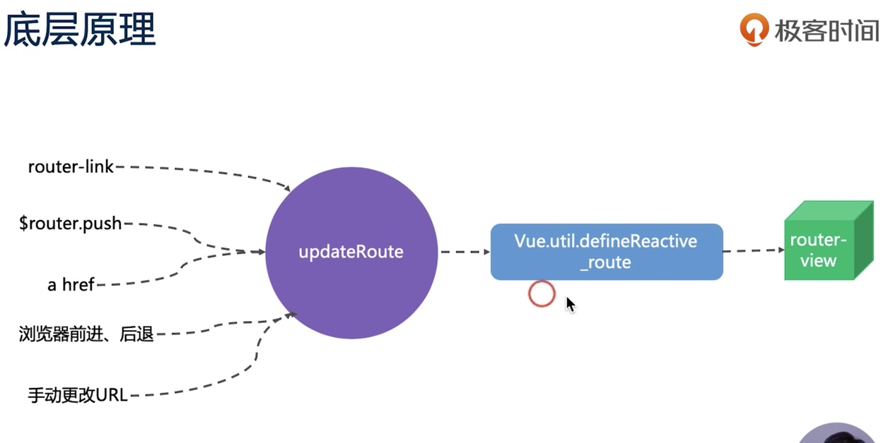
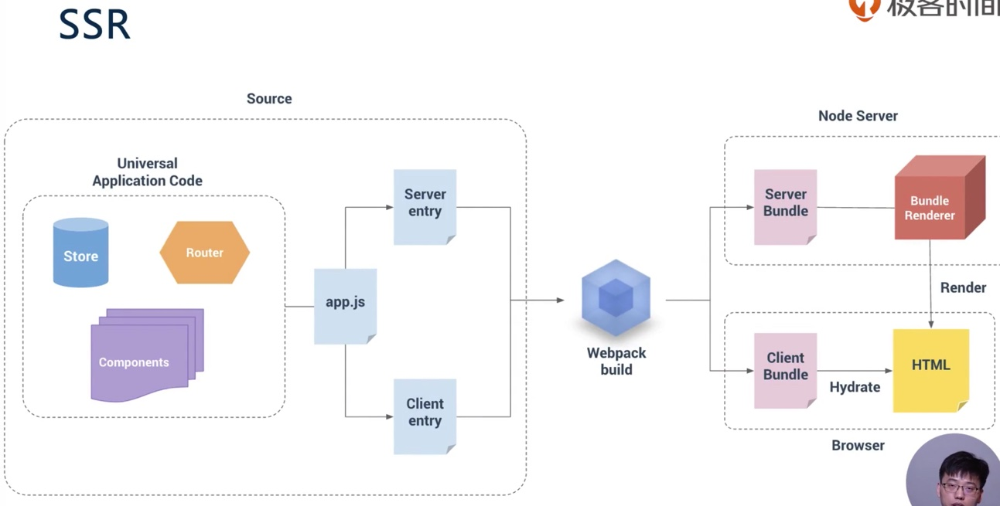
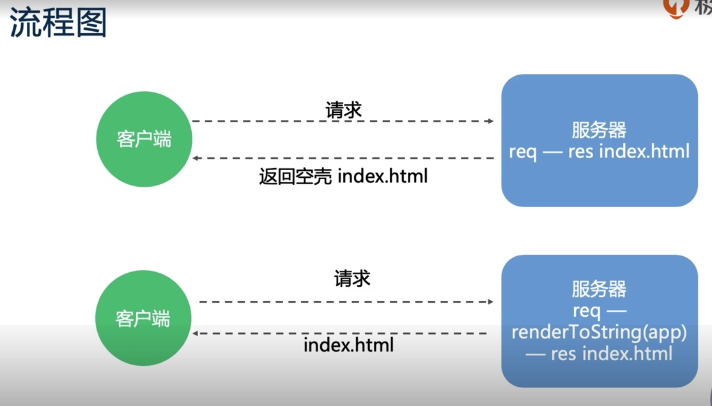

# 第二章：生态篇 (13讲)


# 22 | Vue Router的使用场景
## 传统单页面（spa）开发模式
- www.xxx.com ->index.html
- www.xxx.com/about =>index.html
- www.xxx.com/xxx =>index.html
## Vue Router解决的问题
- 监听URL的变化，并在变化前后执行相应的逻辑
- 不同URL对应不同的组件
- 提供多种方式改变URL的API（URL的改变不能导致浏览器刷新）
### 使用方式
- 提供一个路由配置表，不同URL对应不同组件的配置
- 初始化路由实例 new VueRouter()
- 挂载到Vue实例上
- 提供一个路由占位，用来挂载URL匹配到的组件

- 配置路由列表 main.js
```js
import VueRouter from 'vue-router'
import routes from './routes'

Vue.use(VueRouter);
const router=new VueRouter({
  // mode:history,
  // 加#就当成页面锚点来存储url history模式就要设置服务端的路由允许 不然就当成访问资源 可能造成404
  //mode：hash 默认为hash 就是加#的形式
  routes,
})
new Vue({
  router,
```
- App.vue 
```html
<router-view></router-view>
```
<router-view></router-view> 写在什么地方 routes.js中的
{path:'/foo',component:RouterDemo,name:'1'} 就渲染到什么地方


# 23 | 选择何种模式的路由及底层原理

## 路由类型
- Hash模式 不好看，无法使用锚点定位
- History 模式 需要后端配合，IE9不兼容（可以使用强制刷新处理）
  - 就是在IE9的模式下，不采用AJAX的方式去获取，而是通过强制刷新页面的方式
## 路由底层逻辑

>router-link,$router.push,a href,浏览器刷新、后退,手动更改URL
触发 updateRoute
触发响应式数据 Vue.util.defineReactive 把_route的数据变成响应式的
执行router-view 根据URL匹配想要渲染的组件
# 24 | Nuxt解决了哪些问题？
## SPA(单页Web应用)缺点
- 不利于SEO    
  - 解决办法：服务端SSR 
- 首屏渲染时间长
  - 解决办法：预渲染Prerendering 
### 解决办法：预渲染Prerendering 
- 用于静态页面渲染
### 解决办法：服务端SSR 
- 动态渲染
- 配置繁琐（生命周期 路由 webpack的配置）
## Nuxt的优点
- 静态站点
- 动态渲染
- 简化配置
## 什么是SPA？
### 优点 

>- 有良好的交互体验
能提升页面切换体验，用户在访问应用页面是不会频繁的去切换浏览页面，从而避免了页面的重新加载；
>- 前后端分离开发
单页Web应用可以和 RESTful 规约一起使用，通过 REST API 提供接口数据，并使用 Ajax 异步获取，这样有助于分离客户端和服务器端工作。更进一步，可以在客户端也可以分解为静态页面和页面交互两个部分；
>- 减轻服务器压力
服务器只用出数据就可以，不用管展示逻辑和页面合成，吞吐能力会提高几倍；
>- 共用一套后端程序代码
不用修改后端程序代码就可以同时用于 Web 界面、手机、平板等多种客户端；
### 缺点：

>- SEO难度较高
由于所有的内容都在一个页面中动态替换显示，所以在SEO上其有着天然的弱势，所以如果你的站点对SEO很看重，且要用单页应用，那么就做些静态页面给搜索引擎用吧；
>- 前进、后退管理
由于单页Web应用在一个页面中显示所有的内容，所以不能使用浏览器的前进后退功能，所有的页面切换需要自己建立堆栈管理，当然此问题也有解决方案，比如利用URI中的散列+iframe实现；
>- 初次加载耗时多
为实现单页Web应用功能及显示效果，需要在加载页面的时候将JavaScript、CSS统一加载，部分页面可以在需要的时候加载。所以必须对JavaScript及CSS代码进行合并压缩处理；
### 3. 性能优化


>- 加载优化
在SPA中，通常一开始就会加载所有必需的代码（HTML，JavaScript和CSS），有时候考虑到首屏加载太慢会按需加载，按需加载就是按照当前呈现的不同页面加载不同的文件，而不是最开始就把所有文件都加载出来，从而避免首屏加载很慢。
当首屏加载完毕后，设备&网络处于空闲状态，可以对其他路由组件进行预加载，以便提升页面切换性能。
根据路由拆分减少初始加载体积,利用异步加载方式，在路由注册时提供异步拉取组件的方法，仅在需要进入对应路由时，对应组件才会被加载进来。 

>- 初次加载的速度
单页应用的第一页加载会比基于服务器的应用慢。这是因为首次加载必须先拿到框架和应用程序的代码，再在浏览器中呈现所需的视图。基于服务器的应用程序只需将所需的HTML推送到浏览器，从而减少了延迟和下载用时。

>- 加快页面加载速度
有一些方法可以加快单页应用的初次加载速度，比如采用多项缓存措施、需要时再加载某些模块（懒加载）。

>- 页面生命周期
单页应用在初始页面加载时被完全加载，然后页面区域被替换或更新为按需从服务器加载的新页面片段。为避免过度下载未使用的功能，单页应用通常会逐渐下载更多内容，如所需要的功能、页面的一小块，或者完整的一页。

## 问题：如何不使用SSR实现SEO？

# 25 | Nuxt核心原理是什么？
## SSR或者VUE SSR的渲染流程图

- 1.打包时，提供两个入口文件
  - 1个是serve端使用的 Serve entry
    - 主要返回服务端返回的Vue实例
  - 1个是Client端使用的 Client entry
    - 将Vue实例挂载到指定的DOM元素上
- 2.webpack打包
- 3.node Server
  - 在Node Server中 Server Bundle -> Bundle Renderer
  - 在Browser中 ：Client Bundle = Hydrate(摄入)> HTML
## SSR渲染简易流程

- spa
Client =请求>Server =req - res>index.html
- ssr 优化
Client =请求>Server= req - RenderToString(app) res >index.html
