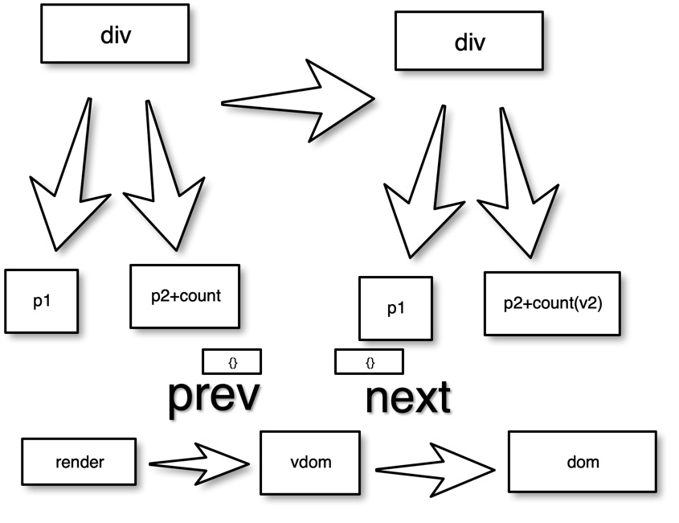

# vue3 原理解析

## 安装环境

```bash
yarn add @vue/reactivity
```

# vue 3 重点核心 收集依赖和触发依赖

## 收集依赖


## 收集依赖


## mini-vue/main.js

0. 定义 const a = ref(10);
1. 函数执行 effect 函数 ，effect 函数 a.value 触发 get 方法，这个时候会将这个 fn 收集进 a 下面
2. update，a.value=20，触发 set 方法，执行 a 收集的所有依赖，触发 fn,输出 b

```js
const a = ref(10);
console.log(a);
let b;
effect(() => {
  b = a.value + 10;
  console.log(b);
});

// update a

a.value = 20;
// console 20 30
```

## 使用视图（view）方法进行显示

1. 在 console 中修改 a.value 就会触发视图的更新
2. 会有问题如文件中所描述 mini-vue2/main.js

## 解决方案

1. 2.1 实现-vdom
2. 2.2 实现-diff算法



view 
1.视图的dom是写死的
dom 
1.公共的逻辑需要抽离 比如都调用了effect 都调用了render，
2.如何更新view? 到那个需要渲染的dom不是单一的时候，却会更新所有元素
方案
2.1 实现-vdom
2.2 实现-diff算法